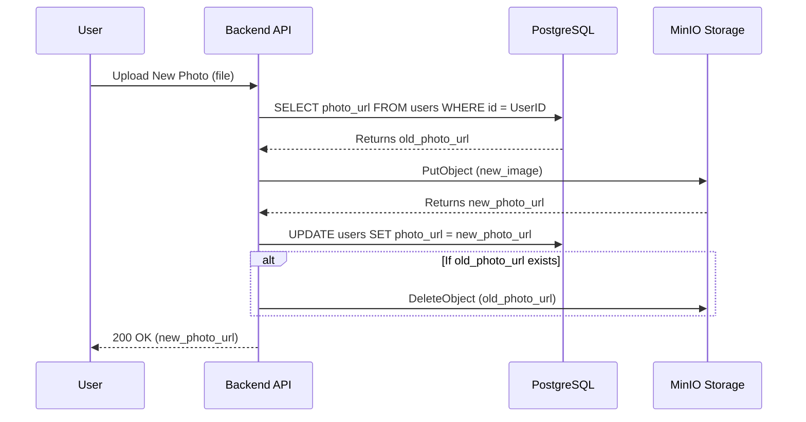

# Authentication & Database Schema Design

## Overview
This document outlines the data structure and dependency flow for the User Authentication system, specifically integrating **PostgreSQL** for user data and **MinIO** for object storage (User Avatars).

## 1. Data Model (PostgreSQL)

### Table: `users`
Stores the core identity information for the user.

| Column Name | Data Type | Constraints | Frontend Variable | Description |
| :--- | :--- | :--- | :--- | :--- |
| `id` | `UUID` | `PRIMARY KEY` | `userId` | Unique identifier. |
| `email` | `VARCHAR(255)` | `UNIQUE`, `NOT NULL` | `email` | User's email address. |
| `full_name` | `VARCHAR(255)` | `NOT NULL` | `userName` | User's display name. |
| `photo_url` | `TEXT` | `NULLABLE` | `userPhoto` | URL to the user's avatar in MinIO. |
| `created_at` | `TIMESTAMP` | `DEFAULT NOW()` | - | Account creation timestamp. |
| `updated_at` | `TIMESTAMP` | `DEFAULT NOW()` | - | Last update timestamp. |

---

## 2. Storage Architecture (MinIO)

### Bucket: `user-avatars`
*   **Access Policy**: Public Read (or Presigned URLs for private access).
*   **Object Naming Convention**: `avatars/{user_id}/{timestamp}_{filename}`
    *   *Reasoning*: Including the timestamp prevents browser caching issues when the image is updated.

---

## 3. Dependency Logic: Photo Update Flow

To ensure storage efficiency, we implement an **"Upload & Purge"** strategy. When a user updates their profile photo, the old photo is automatically removed.

### Workflow Steps:

1.  **Client Action**: User selects a new image and clicks "Update Photo".
2.  **Upload Request**: Client sends the file to the Backend API (e.g., `POST /api/user/avatar`).
3.  **Backend Processing**:
    *   **Step A (Fetch Current)**: Query the `users` table to get the current `photo_url`.
    *   **Step B (Upload New)**: Upload the new image to MinIO bucket `user-avatars`.
    *   **Step C (Update DB)**: Update the `users` table with the new MinIO URL.
    *   **Step D (Cleanup)**:
        *   If `photo_url` (from Step A) was not null:
        *   Parse the object key from the old URL.
        *   Send a `DeleteObject` command to MinIO for that key.
4.  **Response**: Return the new `photo_url` to the client to update the UI context.

### Diagram

## 4. Technology Stack Dependencies

*   **Database**: PostgreSQL (via Supabase or self-hosted).
*   **Object Storage**: MinIO (S3 Compatible).
*   **ORM**: Prisma or Drizzle (recommended for Type Safety).
*   **Backend Framework**: Next.js API Routes (Server Actions).
